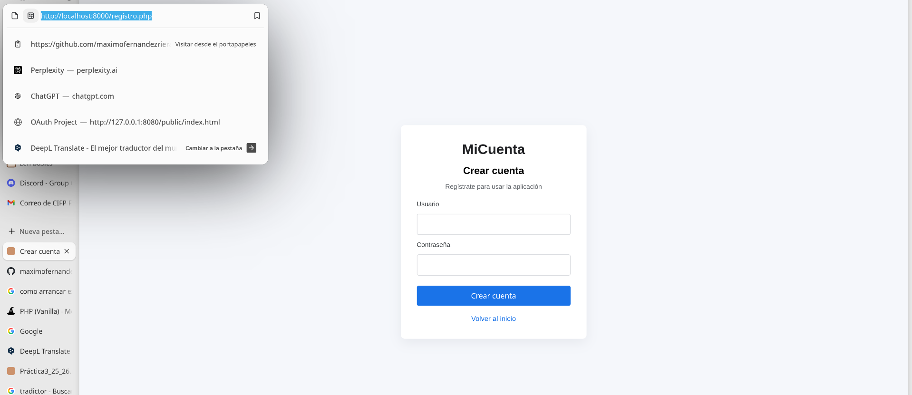
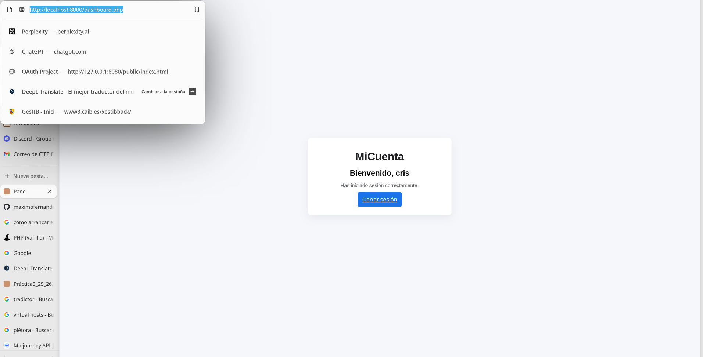
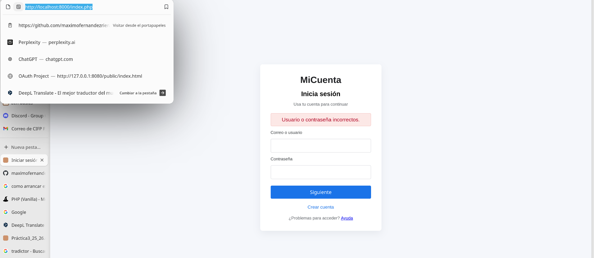
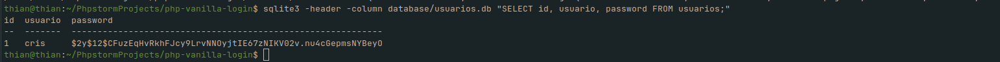
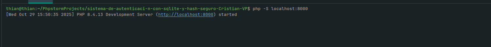

# Sistema de Autenticación con SQLite y Hash Seguro

## Descripción del Proyecto

Este proyecto implementa un **sistema completo de autenticación de usuarios** utilizando PHP, SQLite y las mejores prácticas de seguridad para el manejo de contraseñas mediante las funciones `password_hash()` y `password_verify()`.

El objetivo principal es demostrar cómo construir un sistema seguro de registro e inicio de sesión sin almacenar contraseñas en texto plano, utilizando una base de datos ligera y portátil (SQLite).

---

## Características Implementadas

### 1. **Registro de Usuarios**
- Formulario de registro con validación de campos
- Encriptación automática de contraseñas usando `password_hash()` con algoritmo bcrypt
- Validación de unicidad de nombre de usuario
- Almacenamiento seguro en base de datos SQLite

### 2. **Inicio de Sesión**
- Verificación segura de credenciales mediante `password_verify()`
- Gestión de sesiones PHP
- Protección contra ataques de fuerza bruta mediante comparación segura de hashes
- Redirección automática al panel de control tras autenticación exitosa

### 3. **Panel de Control (Dashboard)**
- Página protegida accesible solo para usuarios autenticados
- Verificación de sesión activa
- Mensaje de bienvenida personalizado
- Opción de cierre de sesión

### 4. **Gestión de Sesiones**
- Implementación completa del ciclo de vida de sesiones
- Destrucción segura de sesiones al cerrar sesión
- Protección de rutas mediante verificación de autenticación

---

## Arquitectura Técnica

### Base de Datos
- **Motor**: SQLite 3
- **Ubicación**: `database/usuarios.db`
- **Tabla**: `usuarios` con estructura:
  - `id`: INTEGER PRIMARY KEY AUTOINCREMENT
  - `usuario`: TEXT UNIQUE
  - `password`: TEXT NOT NULL (almacena el hash bcrypt)

### Seguridad Implementada
- **Hashing de contraseñas**: Se utiliza `password_hash()` con el algoritmo bcrypt que genera un salt único por cada contraseña
- **Verificación segura**: `password_verify()` compara la contraseña ingresada con el hash almacenado sin necesidad de descifrar
- **Consultas preparadas**: Uso de PDO con prepared statements para prevenir inyección SQL
- **Gestión de sesiones**: Control de acceso a páginas protegidas mediante `session_start()` y verificación de variables de sesión

---

## Resultados y Evidencias

### 1. Registro Exitoso de Usuario


Se implementó un formulario intuitivo que permite el registro de nuevos usuarios. El sistema valida que el nombre de usuario sea único y encripta automáticamente la contraseña antes de almacenarla.

### 2. Proceso de Inicio de Sesión


El formulario de login valida las credenciales del usuario comparando la contraseña ingresada con el hash almacenado. Tras una autenticación exitosa, el usuario es redirigido al dashboard.

### 3. Validación de Credenciales Incorrectas


El sistema detecta y notifica cuando se ingresan credenciales inválidas, mostrando un mensaje de error sin revelar información específica sobre qué campo es incorrecto (buena práctica de seguridad).

### 4. Base de Datos con Contraseñas Hasheadas


Evidencia visual de cómo las contraseñas se almacenan de forma segura usando bcrypt. Cada hash es único incluso para contraseñas idénticas, gracias al salt aleatorio incorporado.

**Contenido de la consulta a la base de datos:**
```
screenshots/consulta_usuarios.txt
```

---

## Flujo de Funcionamiento

### Proceso de Registro
1. El usuario accede a `registro.php`
2. Completa el formulario con usuario y contraseña
3. El sistema valida que el usuario no exista
4. La contraseña se procesa con `password_hash()` generando un hash bcrypt
5. Se almacenan los datos en la base de datos SQLite
6. Se confirma el registro exitoso

### Proceso de Login
1. El usuario accede a `login.php`
2. Ingresa sus credenciales
3. El sistema consulta el hash almacenado para ese usuario
4. Se utiliza `password_verify()` para comparar la contraseña ingresada con el hash
5. Si es válido, se inicia sesión y redirige al dashboard
6. Si es inválido, muestra mensaje de error

### Acceso al Dashboard
1. Se verifica que exista una sesión activa
2. Si no hay sesión, redirige al login
3. Si hay sesión válida, muestra el panel de control
4. El usuario puede cerrar sesión desde el dashboard

---

## Tecnologías Utilizadas

- **Lenguaje**: PHP 8.0+
- **Base de Datos**: SQLite 3
- **Conexión**: PDO (PHP Data Objects)
- **Seguridad**: 
  - `password_hash()` con PASSWORD_DEFAULT (bcrypt)
  - `password_verify()` para validación
  - Prepared Statements para prevenir SQL Injection
- **Frontend**: HTML5 + CSS3
- **Gestión de Estado**: PHP Sessions

---

## Ventajas del Enfoque Implementado

1. **Seguridad**: Las contraseñas nunca se almacenan en texto plano
2. **Portabilidad**: SQLite permite un despliegue sencillo sin necesidad de servidor de base de datos externo
3. **Resistencia a ataques**: El uso de bcrypt con salt automático protege contra rainbow tables y ataques de diccionario
4. **Escalabilidad**: La estructura modular permite agregar funcionalidades adicionales fácilmente
5. **Estándares**: Sigue las mejores prácticas recomendadas por OWASP para autenticación

---


**Iniciar el servidor de desarrollo:**  

   

## Estructura del Proyecto

```
/proyecto/
│
├── database/
│   └── usuarios.db          # Base de datos SQLite
│
├── css/
│   └── style.css           # Estilos de la aplicación
│
├── screenshots/            
│   ├── sign_in.png
│   ├── login_success.png
│   ├── wrong_login.png
│   ├── data_base_users.png
│   └── consulta_usuarios.txt
│
├── conexion.php            # Conexión PDO a SQLite
├── crear_tabla.php         # Script para crear la BD y tabla
├── registro.php            # Formulario y lógica de registro
├── login.php              # Procesamiento de inicio de sesión
├── index.php              # Página principal
├── dashboard.php          # Panel de control protegido
├── logout.php             # Cierre de sesión
└── README.md              # Este archivo
```

---
